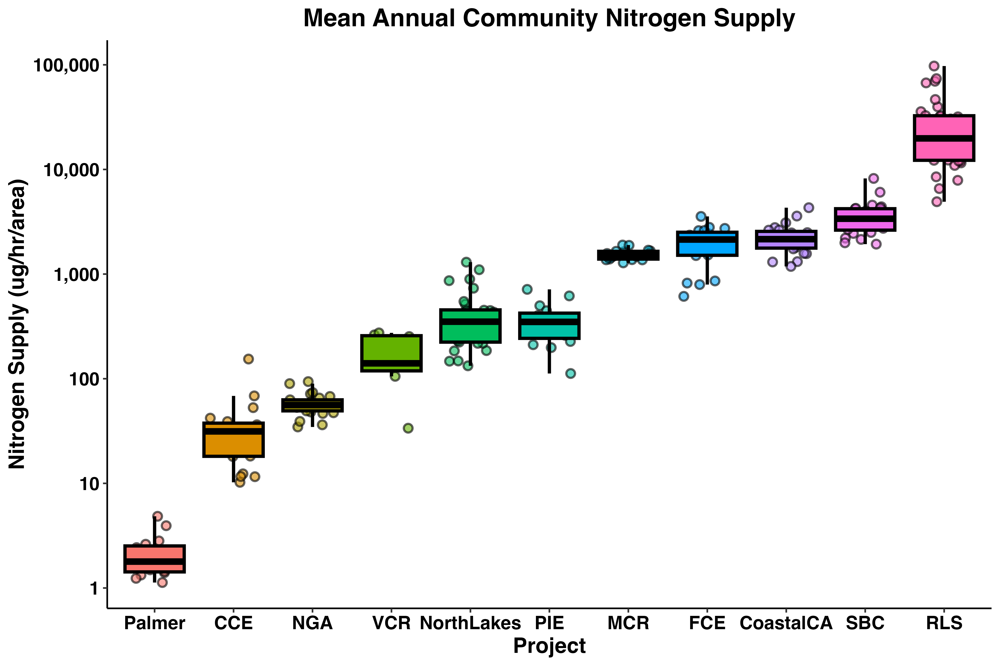
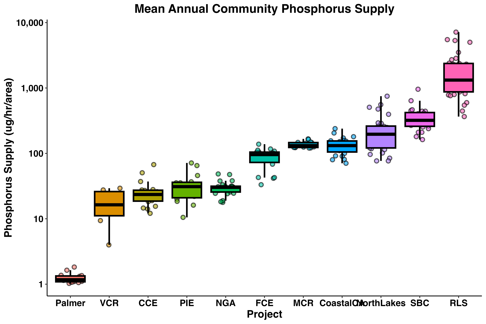
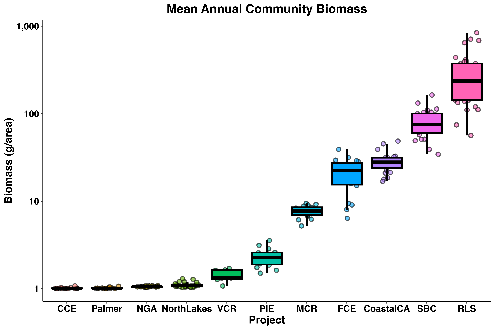
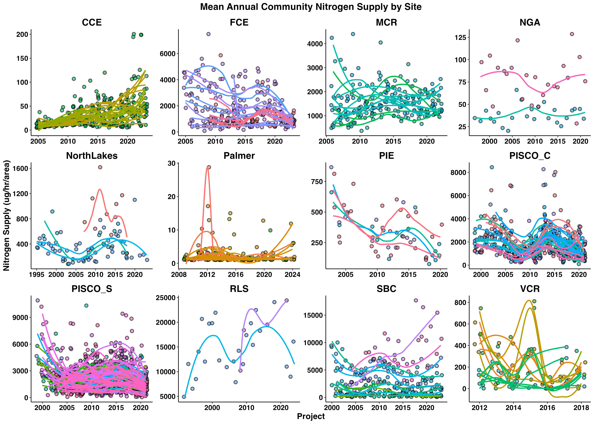

This page houses a curated set of code designed to support the working group as we explore available data and develop analytical frameworks to meet team objectives.

Working group members are encouraged to explore the code, modify it for their own purposes/exploration, and combine ideas across examples for their analyses and curiousities. Code examples are grouped by theme (e.g., data retrieval, modeling, visualization).

## **Data Retrieval - Group Member Shortcuts**

Below we showcase code that can be used to gather data from google drive using the the [`googledrive`](https://cran.r-project.org/web/packages/googledrive/index.html) package. To run the code, you will need to tell the `googledrive` package who you are... please work through [the tutorial](https://lter.github.io/scicomp/tutorial_googledrive-pkg.html) before trying to run the script below :)

**Housekeeping**

**Load necessary packages**

*if you do not have librarian installed, you will need to install it first*

```{r}
#| warning: false
#install.packages('librarian')
librarian::shelf(tidyverse, googledrive)
```

[`librarian()`](https://cran.r-project.org/web/packages/librarian/vignettes/intro-to-librarian.html) is nice because it automatically installs, updates, and attaches packages

**Clear environment and collect garbage**

```{r}
rm(list = ls()); gc()
```

[`gc()`](https://www.rdocumentation.org/packages/base/versions/3.6.2/topics/gc) is nice because it reclaims unused R memory, useful when working with large datasets :)

**Load custom functions**

```{r}
purrr::walk(.x = dir(path = file.path("tools"), pattern = "fxn_"),
            .f = ~ source(file = file.path("tools", .x)))
```

### **Download keys**

```{r}
download_drive_folder(
  folder_url = "https://drive.google.com/drive/folders/1of2tKXcU_KnNDZrYLt3b3smObNrG_aXD",
  local_subfolder = file.path("Data", "-keys"))
```

### **Download raw community data**

```{r}
download_drive_folder(
  folder_url = "https://drive.google.com/drive/folders/1n6iqs3aK2xWkROI8nPSVfk6ZkYPNpF7F",
  local_subfolder = file.path("Data", "community_raw-data"))
```

### **Download raw terrestrial species data**

```{r}
download_drive_folder(
  folder_url = "https://drive.google.com/drive/folders/14H0hFBHxiqfubRBZ7DUUOSxMh5NOeiJN",
  local_subfolder = file.path("Data", "species_raw-data"))
```

### **Download raw trait data**

```{r}
download_drive_folder(
  folder_url = "https://drive.google.com/drive/folders/1UAq72kFD8Hh9uV1_He1ijJQ1m4lVg7eK",
  local_subfolder = file.path("Data", "traits_raw-data"),
  pattern_in = ".csv")
```

### **Download raw environmental data**

```{r}
download_drive_folder(
  folder_url = "https://drive.google.com/drive/folders/1yUg4tYF7F-fuamODUOy55JUg8tmaUyYD",
  local_subfolder = file.path("Data", "environmental_raw-data"))
```

### **Download community_tidy data**

```{r}
download_drive_folder(
  folder_url = "https://drive.google.com/drive/folders/1LE1Rr1Hfa1uZPvZoUIr1t18khnsnbeFV",
  local_subfolder = file.path("Data", "community_tidy-data"))
```

### **Download traits_tidy data**

```{r}
download_drive_folder(
  folder_url = "https://drive.google.com/drive/folders/1KPv27jTBIwGwuHNU3-EyWlubN9xXjIDt",
  local_subfolder = file.path("Data", "traits_tidy-data"))
```

### **Download species_tidy data**

```{r}
download_drive_folder(
  folder_url = "https://drive.google.com/drive/folders/1VOJpEarHAs1csIzAT7pobWXWXjLt6TdN",
  local_subfolder = file.path("Data", "species_tidy-data"))
```

## **Data Retrieval - Group Member Steup**

Below we showcase code that can be used to create necessary local folder(s) for following scripts

**Housekeeping**

**Load necessary packages**

*if you do not have librarian installed, you will need to install it first*

```{r}
#| warning: false
#install.packages('librarian')
librarian::shelf(tidyverse, googledrive)
```

**Clear environment and collect garbage**

```{r}
rm(list = ls()); gc()
```

### **Make folders**

#### ***create top-level folders***

```{r}
dir.create(path = file.path("Data"), showWarnings = F)
```

#### ***create some useful, one-off 'Data/" subfolders***

```{r}
dir.create(path = file.path("Data", "-keys"), showWarnings = F)
dir.create(path = file.path("Data", "checks"), showWarnings = F)
dir.create(path = file.path("Data", "mixed_tidy-data"), showWarnings = F)
```

#### ***create 'raw' and 'tidy' subfolders of "Data/" for each data type***

```{r}
## Identify all data types
data_types <- c("community", "traits", "environmental", "species")
## Actually make folders
purrr::walk(.x = paste0(data_types, sort(rep(c("_raw-data", "_tidy-data"), 
                                               times = length(data_types)))),
            .f = ~ dir.create(path = file.path("Data", .x),
                              showWarnings = F, recursive = T))
```

**Clear environment and collect garbage**

```{r}
rm(list = ls()); gc()
```

## **Data Exploration - Mack Consumer Figures**

```{r}
librarian::shelf(tidyverse, readxl, scales, broom, purrr, dataRetrieval,
                 splitstackshape, forcats)
```

```{r}
nacheck <- function(df) {
      na_count_per_column <- sapply(df, function(x) sum(is.na(x)))
      print(na_count_per_column)
}
```

```{r}
dat <- read_csv('../lter-sparc-consumer-fxn-diversity/04_harmonized_consumer_excretion_sparc_cnd_site.csv')
glimpse(dat)
nacheck(dat)

dat1 <- dat |> 
      mutate(subsite_level1 = replace_na(subsite_level1, "Not Available"),
             subsite_level2 = replace_na(subsite_level2, "Not Available"),
             subsite_level3 = replace_na(subsite_level3, "Not Available")) |> 
      select(project, year, month, habitat, temp_c, site, subsite_level1, subsite_level2, subsite_level3,
             scientific_name, diet_cat, nind_ug.hr, pind_ug.hr, count_num, density_num.m, density_num.m2, 
             density_num.m3,biomass_g, dmperind_g.ind, kingdom, phylum, class, order, family, genus)
glimpse(dat1)
nacheck(dat1)
```

```{r}
dt_total <- dat1 |> 
      group_by(project, habitat, year, month, 
               site, subsite_level1, subsite_level2, subsite_level3) |> 
      summarize(
            ### calculate total nitrogen supply at each sampling unit and then sum to get column with all totals
            total_nitrogen.m = sum(nind_ug.hr * density_num.m, na.rm = TRUE),
            total_nitrogen.m2 = sum(nind_ug.hr * density_num.m2, na.rm = TRUE),
            total_nitrogen.m3 = sum(nind_ug.hr * density_num.m3, na.rm = TRUE),
            ### create column with total_nitrogen contribution for each program, regardless of units
            total_nitrogen = sum(total_nitrogen.m + total_nitrogen.m2 + total_nitrogen.m3, na.rm = TRUE),
            ### calculate total phosphorus supply at each sampling unit and then sum to get column with all totals
            total_phosphorus.m = sum(pind_ug.hr * density_num.m, na.rm = TRUE),
            total_phosphorus.m2 = sum(pind_ug.hr * density_num.m2, na.rm = TRUE),
            total_phosphorus.m3 = sum(pind_ug.hr * density_num.m3, na.rm = TRUE),
            ### create column with total_phosphorus contribution for each program, regardless of units
            total_phosphorus = sum(total_phosphorus.m + total_phosphorus.m2 + total_phosphorus.m3, na.rm = TRUE),
            ### calculate total biomass at each sampling unit and then sum to get column with all totals
            total_bm.m = sum(dmperind_g.ind*density_num.m, na.rm = TRUE),
            total_bm.m2 = sum(dmperind_g.ind*density_num.m2, na.rm = TRUE),
            total_bm.m3 = sum(dmperind_g.ind*density_num.m3, na.rm = TRUE),
            ### create column with total_biomass for each program, regardless of units
            total_biomass = sum(total_bm.m + total_bm.m2 + total_bm.m3, na.rm = TRUE)) |> 
      ungroup() |>
      arrange(project, habitat, year, month, site, subsite_level1, subsite_level2, subsite_level3) |> 
      filter(habitat!= 'beach')
nacheck(dt_total)
```

```{r}
dt_total |> 
      mutate(project = as.factor(project)) |> 
      filter(!project %in% c('Arctic')) |> 
      group_by(project, year) |> 
      summarize(
            mean = mean(total_nitrogen + 1, na.rm = TRUE),
            median = median(total_nitrogen + 1, na.rm = TRUE),
            .groups = 'drop'
      ) |> 
      mutate(
            project = fct_reorder(project, median)
      ) |> 
      # filter(mean < 25000) |>
      ggplot(aes(x = project, y = mean)) + 
      geom_jitter(aes(fill = project), shape = 21, width = 0.3,
                  color ='black', size = 2, stroke = 1, alpha = 0.6) +
      geom_boxplot(aes(fill = project), position = position_dodge(0.8),
                   outlier.shape = NA, alpha = 1, size = 1, color = 'black') +
      scale_y_log10(
            breaks = 10^(-2:6),
            labels = label_number(big.mark = ",")
      ) +
      labs(x = 'Project', y = 'Nitrogen Supply (ug/hr/area)',
           title = 'Mean Annual Community Nitrogen Supply') + 
      theme(
            strip.text = element_text(size = 16, face = "bold", colour = "black"),
            strip.background = element_blank(),  
            axis.text = element_text(size = 12, face = "bold", colour = "black"),
            axis.title = element_text(size = 14, face = "bold", colour = "black"),
            panel.grid.major = element_blank(),
            panel.grid.minor = element_blank(),
            panel.border = element_blank(),
            panel.background = element_blank(),
            axis.line = element_line(colour = "black"),
            legend.position = "none",
            plot.title = element_text(size = 16, face = "bold", colour = "black",
                                      hjust = 0.5)
      )

ggsave('output/n_boxplot-all.png', dpi = 600, 
       units= 'in', height = 6, width = 9)
```



```{r}
dt_total |> 
      mutate(project = as.factor(project)) |> 
      filter(!project %in% c('Arctic')) |> 
      group_by(project, year) |> 
      summarize(
            mean = mean(total_phosphorus + 1, na.rm = TRUE),
            median = median(total_phosphorus + 1, na.rm = TRUE),
            .groups = 'drop'
      ) |> 
      mutate(
            project = fct_reorder(project, median)
      ) |> 
      # filter(mean < 25000) |>
      ggplot(aes(x = project, y = mean)) + 
      geom_jitter(aes(fill = project), shape = 21, width = 0.3,
                  color ='black', size = 2, stroke = 1, alpha = 0.6) +
      geom_boxplot(aes(fill = project), position = position_dodge(0.8),
                   outlier.shape = NA, alpha = 1, size = 1, color = 'black') +
      scale_y_log10(
            breaks = 10^(-2:6),
            labels = label_number(big.mark = ",")
      ) +
      labs(x = 'Project', y = 'Phosphorus Supply (ug/hr/area)',
           title = 'Mean Annual Community Phosphorus Supply') + 
      theme(
            strip.text = element_text(size = 16, face = "bold", colour = "black"),
            strip.background = element_blank(),  
            axis.text = element_text(size = 12, face = "bold", colour = "black"),
            axis.title = element_text(size = 14, face = "bold", colour = "black"),
            panel.grid.major = element_blank(),
            panel.grid.minor = element_blank(),
            panel.border = element_blank(),
            panel.background = element_blank(),
            axis.line = element_line(colour = "black"),
            legend.position = "none",
            plot.title = element_text(size = 16, face = "bold", colour = "black",
                                      hjust = 0.5)
      )

ggsave('output/p_boxplot-all.png', dpi = 600, 
       units= 'in', height = 6, width = 9)
```



```{r}
dt_total |> 
      mutate(project = as.factor(project)) |> 
      filter(!project %in% c('Arctic')) |> 
      group_by(project, year) |> 
      summarize(
            mean = mean(total_biomass + 1, na.rm = TRUE),
            median = median(total_biomass + 1, na.rm = TRUE),
            .groups = 'drop'
      ) |> 
      mutate(
            project = fct_reorder(project, median)
      ) |> 
      # filter(mean < 25000) |>
      ggplot(aes(x = project, y = mean)) + 
      geom_jitter(aes(fill = project), shape = 21, width = 0.3,
                  color ='black', size = 2, stroke = 1, alpha = 0.6) +
      geom_boxplot(aes(fill = project), position = position_dodge(0.8),
                   outlier.shape = NA, alpha = 1, size = 1, color = 'black') +
      scale_y_log10(
            breaks = 10^(-2:6),
            labels = label_number(big.mark = ",")
      ) +
      labs(x = 'Project', y = 'Biomass (g/area)',
           title = 'Mean Annual Community Biomass') + 
      theme(
            strip.text = element_text(size = 16, face = "bold", colour = "black"),
            strip.background = element_blank(),  
            axis.text = element_text(size = 12, face = "bold", colour = "black"),
            axis.title = element_text(size = 14, face = "bold", colour = "black"),
            panel.grid.major = element_blank(),
            panel.grid.minor = element_blank(),
            panel.border = element_blank(),
            panel.background = element_blank(),
            axis.line = element_line(colour = "black"),
            legend.position = "none",
            plot.title = element_text(size = 16, face = "bold", colour = "black",
                                      hjust = 0.5)
      )

ggsave('output/bm_boxplot-all.png', dpi = 600, 
       units= 'in', height = 6, width = 9)
```



```{r}
systems <- dat |> 
      select(project, habitat, site, subsite_level1, subsite_level2, subsite_level3) |> 
      distinct()
```

```{r}
dt_total |> 
      mutate(project = as.factor(project)) |> 
      filter(!project %in% c('Arctic')) |> 
      mutate(project = case_when(
            project == 'CoastalCA' & site == 'CENTRAL' ~ 'PISCO_C',
            project == 'CoastalCA' & site == 'SOUTH' ~ 'PISCO_S',
            TRUE ~ project
      )) |> 
      mutate(
            system = case_when(
                  project == 'SBC' & habitat == 'beach' ~ site,
                  project == 'SBC' & habitat == 'ocean' ~ site,
                  project == 'Palmer' ~ site,
                  project == 'CCE' ~ paste(site, subsite_level1, sep = ''),
                  project == 'FCE' ~ paste(site, subsite_level1, sep = ''),
                  project == 'NGA' ~ subsite_level1,
                  project == 'NorthLakes' ~ site,
                  project == 'VCR' ~ paste(subsite_level1, subsite_level2, sep = ''),
                  project == 'PIE' ~ site,
                  project == 'MCR' ~ paste(subsite_level1, subsite_level2, sep = ''),
                  project == 'PISCO_C' ~ subsite_level2,
                  project == 'PISCO_S' ~ subsite_level2,
                  project == 'FISHGLOB' ~ site,
                  project == 'RLS' ~ site)
      ) |> 
      group_by(project, system, year) |> 
      summarize(
            mean = mean(total_nitrogen + 1, na.rm = TRUE),
            median = median(total_nitrogen + 1, na.rm = TRUE),
            .groups = 'drop'
      ) |> 
      filter(mean < 25000) |>
      filter(!project == 'CCE' | mean <= 1000) |>
      filter(!project == 'NorthLakes' | mean <= 2000) |>
      filter(!project == 'PISCO_S' | mean <= 15000) |>
      filter(!project == 'SBC' | mean <= 20000) |>
      filter(!project == 'VCR' | mean <= 1000) |>
      filter(!project == 'FCE' | mean <= 10000) |>
      ggplot(aes(x = year, y = mean, fill = system, color = system, group = system)) + 
      geom_jitter(aes(fill = system), shape = 21, width = 0.3,
                  color ='black', size = 2, stroke = 1, alpha = 0.6) +
      geom_smooth(method = 'loess', se = FALSE) +
      facet_wrap(~project, scale = 'free') + 
      labs(x = 'Project', y = 'Nitrogen Supply (ug/hr/area)',
           title = 'Mean Annual Community Nitrogen Supply by Site') + 
      theme(
            strip.text = element_text(size = 16, face = "bold", colour = "black"),
            strip.background = element_blank(),  
            axis.text = element_text(size = 12, face = "bold", colour = "black"),
            axis.title = element_text(size = 14, face = "bold", colour = "black"),
            panel.grid.major = element_blank(),
            panel.grid.minor = element_blank(),
            panel.border = element_blank(),
            panel.background = element_blank(),
            axis.line = element_line(colour = "black"),
            legend.position = "none",
            plot.title = element_text(size = 16, face = "bold", colour = "black",
                                      hjust = 0.5)
      )

ggsave('output/nsupply-ts-all.png', dpi = 600, 
       units= 'in', height = 10, width = 14)
```



```{r}
system_m <- dt_total |> 
      mutate(project = as.factor(project)) |> 
      filter(!project %in% c('Arctic')) |> 
      mutate(project = case_when(
            project == 'CoastalCA' & site == 'CENTRAL' ~ 'PISCO_C',
            project == 'CoastalCA' & site == 'SOUTH' ~ 'PISCO_S',
            TRUE ~ project
      )) |> 
      mutate(
            system = case_when(
                  project == 'SBC' & habitat == 'beach' ~ site,
                  project == 'SBC' & habitat == 'ocean' ~ site,
                  project == 'Palmer' ~ site,
                  project == 'CCE' ~ paste(site, subsite_level1, sep = ''),
                  project == 'FCE' ~ paste(site, subsite_level1, sep = ''),
                  project == 'NGA' ~ subsite_level1,
                  project == 'NorthLakes' ~ site,
                  project == 'VCR' ~ paste(subsite_level1, subsite_level2, sep = ''),
                  project == 'PIE' ~ site,
                  project == 'MCR' ~ paste(subsite_level1, subsite_level2, sep = ''),
                  project == 'PISCO_C' ~ subsite_level2,
                  project == 'PISCO_S' ~ subsite_level2,
                  project == 'FISHGLOB' ~ site,
                  project == 'RLS' ~ paste(site, subsite_level1, sep = ''),
                  
            )
      ) |> 
      group_by(project, system, year) |> 
      summarize(
            mean = mean(total_nitrogen + 1, na.rm = TRUE),
            median = median(total_nitrogen + 1, na.rm = TRUE),
            .groups = 'drop'
      )
```
