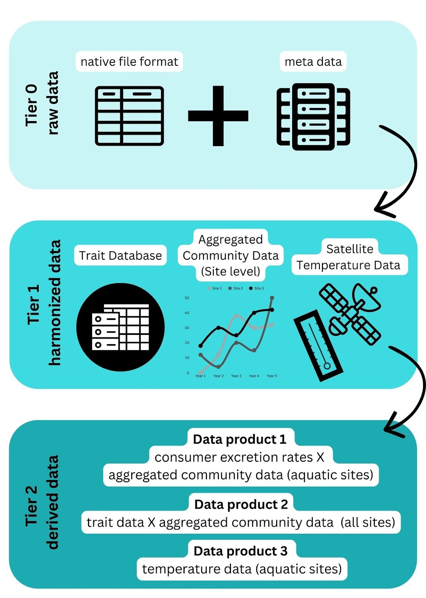

**Project**: Temporal variation in taxonomic and functional diversity and nutrient cycling of consumers across aquatic ecosystems and LTER sites (Consumer Functional Diversity)

**Funding**: National Science Foundation Long Term Ecological Research Synthesis Grant

**Principal Investigators**: Shalanda Grier, Lauren Enright, Mack White, and Camille Magneville

**Database Managers:** Li Kui and Nick Lyon 

*The following agreement has benefited greatly from and contains significant portions of templates/information derived from peer-reviewed literature (i.e., [Cheruvelil et al., 2014](https://esajournals.onlinelibrary.wiley.com/doi/epdf/10.1890/130001); [Boland et al., 2017](https://journals.plos.org/ploscompbiol/article?id=10.1371/journal.pcbi.1005278)) and formalized data policies (i.e., [Soil Data Harmonization & Synthesis](https://lter.github.io/som-website/index.html), [Arctic Data Center](https://arcticdata.io/), [Environmental Data Initiative](https://edirepository.org/)). Each of these resources were used in consideration of the LTER data requirements for synthesis working groups. This policy is a living document that may be revised to reflect changes in working group participants, datasets, and project goals while ensuring compliance with the LTER derived data requirements per our funding agreements.*

**Background:** It is well established that collaborative synthesis research elicits a deeper and more holistic understanding of our natural world. In this synthesis effort, we will use publicly available data published in peer-reviewed articles, and data from unpublished sources. Detailed metadata and a thorough understanding of each dataset will be necessary to link them across sites in a single database. As such, the cooperation and collaboration of scientists with intimate understandings of their respective datasets/sites will be critical to generating accurate research products. Furthermore, we believe that the working group will greatly benefit from the intellectual contributions of a team of scientists with diverse research backgrounds.

This project will synthesize multiple data sources. This includes, but is not limited to data published in publicly available databases, data which is publicly available but are protected via prior data sharing agreements, and those which are not publicly available. The primary purpose of this document is to facilitate clear understanding of how data will be (**1**) used and (**2**) shared. It is expected that perspectives and technologies concerning data will change through conversations with working group participants and any revisions to the data policy will result from discussions with the entirety of the working group and if changed, the updated document will be shared via email with the working group. We look to the SOils DAta Harmonization (SoDaH) & Synthesis working group to differentiate data at different tiers of manipulation (see below).

*modified from SoDaH working group workflow figure*

Raw data (Tier 0) in their native format, alongside metadata will be housed in the working groups [google drive](https://drive.google.com/drive/folders/1AxdFQ0EjNqaLUTzms4prF52cqbVFec0F?usp=drive_link) and R scripts for data wrangling will be archived in [LTER working group GitHub repository](https://github.com/lter/lter-sparc-consumer-fxn-diversity) to facilitate data harmonization (Tier 1), aggregation, and dataset end-products (Tier 2). The derived database will be managed by the database managers, Li Kui (UCSB, [lkui\@ucsb.edu](mailto:lkui@ucsb.edu)) and Nick Lyon (NCEAS, lyon\@nceas.ucsb.edu). The database managers and principal investigators (Shalanda Grier [shalandagrier\@ucsb.edu](mailto:shalandagrier@ucsb.edu), Lauren Enright; [laurenenright\@ucsb.edu](mailto:laurenenright@ucsb.edu), Mack White; [mackwhiteecology\@gmail.com](mailto:mackwhiteecology@gmail.com), and Camille Magneville; [camille.magneville\@bio.au.dk](mailto:camille.magneville@bio.au.dk)) are the only individuals with authority to modify the Tier 2 data and will only do so if necessary. Any modifications to the Tier 2 will be summarized in GitHub and available for review by all working group participants and collaborators. Working group participants and collaborators are not allowed to share or make available in any form data contained within the database during the duration of the project, unless discussed with the entirety of the working group.

**Data package: The final datasets (Tier 2) will be published as three data packages through the Environmental Data Initiative (EDI).** All Tier 0 data will be acknowledged as data sources for the final data package. Participants who provided Tier 1 data will be invited to opt-in as coauthors on the data package (see more details in the authorship agreement). We strongly suggest that each data provider publish their individual dataset (Tier 0 or/and Tier 1) separately through EDI. This will ensure that each dataset can be properly cited in the final data package and read directly into R script for analysis. To ensure high quality metadata, we expect data owners to provide written metadata with appropriate column attributions, sampling methods, temporal and spatial coverage, and data distribution preference (e.g., cite in the final data package as a data source or specific intellectual right). The co-authors of the Tier 2 data package are expected to review and ensure that content and format in the final data package are both accurate and consistent across sites. 

We anticipate this working group will publish three Tier 2 data packages. 1) consumer excretion rates X aggregated community data (aquatic sites), 2) trait data X aggregated community data (aquatic and terrestrial sites), and 3) satellite temperature data (aquatic sites). 

**GitHub:** All analyses will be conducted in R. Some data reports may be generated through Rmarkdown. All code for analysis and visualization will be shared on the working group GitHub repository. The final version of the analysis scripts, upon publication of the manuscript, will be made publicly available in Zenodo.
