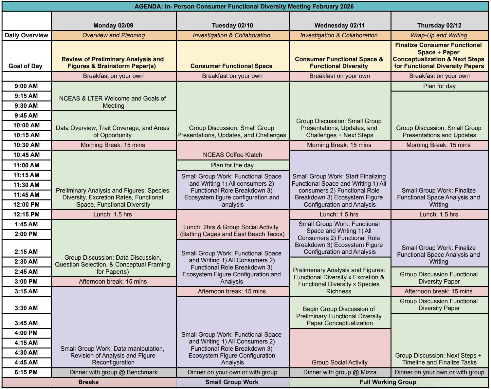

---
about:
  id: header
  template: trestles
  image: images/fnxDiversity image.png
  image-width: 10cm
  image-shape: round
  links:
    - href: https://github.com/lter/lter-sparc-consumer-fxn-diversity
      text: Main Repository
      icon: github
    - href: https://www.nceas.ucsb.edu/visiting-NCEAS
      text: NCEAS Info
      icon: archive-fill
    - href: https://uphamhotel.com/
      text: Hotel Info
      icon: building-fill
---

::: {#header}
This working group aims to assess spatiotemporal patterns of functional diversity in consumer populations and communities across time and in response to global change by utilizing time-series data from long-term research programs. This website will be used to house resources such as code, literature, and in-person/virtual meeting details for working group members.

### Working Group Meeting

The working group will convene at the National Center for Ecological Analysis and Synthesis ([NCEAS](https://www.nceas.ucsb.edu/)) the week of February 9-13, 2026. Our meetings will begin each morning at 9 AM and end at 5 PM. Feel free to bring your own snacks to enjoy during meeting breaks throughout the week. NCEAS will be providing plenty of coffee for us! For those joining remotely, find zoom link [here](https://ucsb.zoom.us/j/82585962094?pwd=4uXbTAja5N0ax3fXkJzKXabPJ9amWF.1)
:::

## **Goals of Working Group Meeting**

**1)** Prepare a draft of the working group's first manuscript 

**2)** Generate a robust outline and seed analyses/figures for the working group's second manuscript 

**3)** Publication of one working group data package

## **Pre-Meeting Tasks**

We ask each of the working group members to ensure they have access to the working group’s Google Drive and [Github](https://github.com/lter/lter-sparc-consumer-fxn-diversity). Additionally, please review the authorship and data guidelines if you have not already! We will briefly discuss these guidelines as a group on Monday.

## **Draft of Meeting Schedule**

