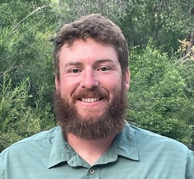
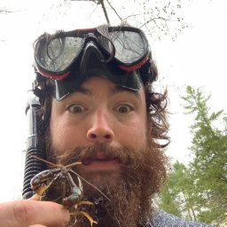

---
about:
  id: header
  template: trestles
  image: images/fnxDiversity.png
  image-width: 10cm
  image-shape: round
  links:
    - href: https://github.com/lter/lter-sparc-consumer-fxn-diversity
      text: Main Repository
      icon: github
    - href: https://www.nceas.ucsb.edu/visiting-NCEAS
      text: NCEAS Info
      icon: archive-fill
    - href: https://uphamhotel.com/
      text: Hotel Info
      icon: building-fill

---

::: {#header}
This working group aims to assess spatiotemporal diversity patterns of aquatic consumers across time and in response to global change by utilizing consumer population time-series data from long-term monitoring programs.

### Working Group Meeting 

The working group will convene at the National Center for Ecological Analysis and Synthesis ([NCEAS](https://www.nceas.ucsb.edu/)) the week of February 9-13, 2026. Please see drafted schedule below.

*photo by ChatGPT 5.2*
:::

## **About the Instructors**

#### Dr. Casey Pennock

 Dr. Casey Pennock is an aquatic ecologist with broad research interests spanning multiple levels of biological organization from populations to communities to ecosystems. They conduct research in a wide range of freshwater habitats, and are particularly interested in population and community dynamics and fish movement. They are interested in answering both basic and applied questions to inform conservation and management of freshwater ecosystems. Learn more about their research [here](https://u.osu.edu/pennocklab/).

#### Dr. Mack White

 Dr. Mack White is a broadly trained aquatic ecologist and postdoctoral research scientist at The Ohio State University. His research investigates how the direct and indirect effects of global change shape animal populations and communities, and how these changes propagate to influence nutrient cycling and energy flow. His research takes an integrative approach that uses a combination of field, experimental, modeling, and synthesis approaches to build predictive frameworks and provide a more holistic understanding of the natural world that informs conservation efforts, as well as ecological theory. Learn more about their research [here](https://mackwhite.github.io/)

## **About the Dataset**

Ohio is defined by its abundant water resources, bordered by the Ohio River to the south and Lake Erie to the north. Together with thousands of miles of streams and rivers and extensive lakes and wetlands, these waters play a central role in supporting ecosystems, communities, and quality of life across the state. The Ohio Environmental Protection Agency’s Division of Surface Water oversees a wide range of monitoring and assessment programs spanning inland lakes, Lake Erie, headwater streams, rivers, and wetlands, as well as comprehensive watershed studies.

Each year, Ohio EPA scientists survey approximately 400–450 stream and river sites statewide as part of these watershed assessments. Field crews collect chemical water samples, evaluate fish and aquatic macroinvertebrate communities, and measure physical characteristics of streams to assess overall condition. These efforts are guided by three primary goals: evaluating whether streams meet expectations outlined in [Ohio’s Water Quality Standards](https://epa.ohio.gov/divisions-and-offices/surface-water/regulations/effective-rules/effective-rules), determining whether those expectations are appropriate and achievable, and identifying changes in stream condition since previous assessments.

Data from field surveys are analyzed and synthesized into [biological and water quality reports](https://epa.ohio.gov/divisions-and-offices/surface-water/reports-data/biological-and-water-quality-reports), which inform both scientific understanding and management decisions. See Final 2024 integrated report [here](https://dam.assets.ohio.gov/image/upload/epa.ohio.gov/Portals/35/tmdl/2024intreport/Full-2024-IR.pdf). Collectively, these assessments also underpin Ohio’s identification of impaired and threatened waters under [Section 303(d) of the Clean Water Act](https://www.eli.org/sites/default/files/files-pdf/2025%20Introduction%20to%20the%20Clean%20Water%20Act%20Section%20303%28d%29%20Program.pdf).

Text adapted from materials produced by the [Ohio Environmental Protection Agency](https://epa.ohio.gov/home). 